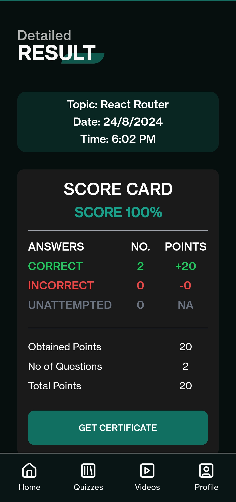

    

    <h1>Cuizzy</h1>
    
Challenge your limits

    
    
    

 

## ⚡ Introduction

Cuizzy is an app for online computer science or coding quizzes, as well as learning new topics by watching video content on the platform.

## ✨ Features

- User experience-centric, modern interface
- User authentication by `Firebase`
  - Google Signin
  - Email/Password Signin
- Option to edit profile and reset password
- Marking based quizzes
- Certificate on successful completion
- Quiz submission history
- Video tutorials to learn computer science topics

## ⚙️ Tech Stack

- React Native
- Expo
- Tailwind CSS
- Firebase
- Lucide Icons

## 📦 Other Libraries and Tools

- Lodash
- PDF LIB JS
- React Native Toast
- React Native Youtube Iframe

## 🎯 Goals

- [x] Master `React Native` and `Expo` to develop a project showcasing proficiency
- [x] Implement public and private routing effectively using `Expo Router`
- [x] Establish user authentication using context providers using `RN Async Storage` for enhanced security
- [x] Seamlessly integrate a `BAAS` into a React Native application for streamlined backend operations

## 🖼️ Screenshots

## 👋🏻 Contact

